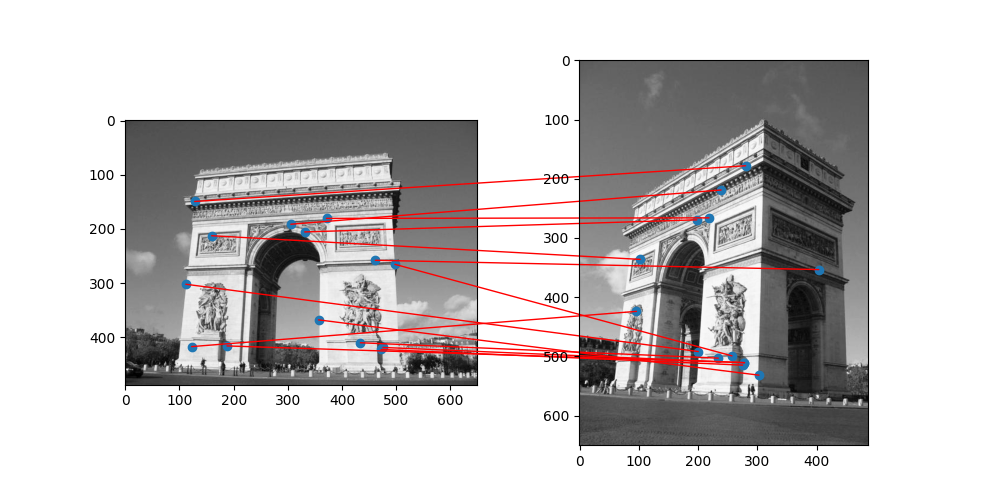
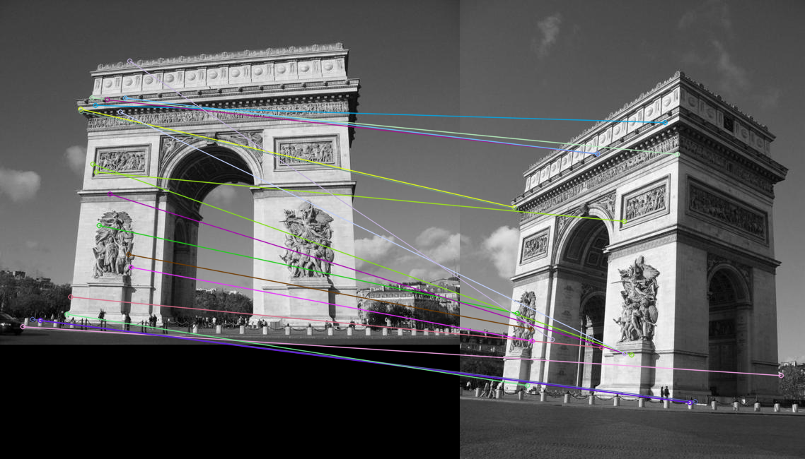

# Python SIFT implemenation with only Numpy
This implementation is based on two paper:
- [Distinctive Image Features from Scale-Invariant Keypoints](https://www.cs.ubc.ca/~lowe/papers/ijcv04.pdf), David G. Lowe.
- [The Anatomy of the SIFT Method](http://www.ipol.im/pub/art/2014/82/article.pdf), Ives Rey Otero, Mauricio Delbracio.
> Notice: The later one provides a detailed analysis and better parameters' setting of SIFT, thus this implementation utilize 
its parameters's setting as standard configuration.


## Module explanation
| Module                   | Intention                                                                            |
|--------------------------|--------------------------------------------------------------------------------------|
| sift.py                  | Main function. Builds SIFT instance, detects and plots matching result in two images.|
| octaves.py               | Builds increasingly blurred Gaussian and DoG octaves.                                |
| keypoints.py             | Generates candidate keypoints from DoG octave extrema.                               |
| orientations.py          | Assigns a reference orientation to a keypoint based on local gradients.              |
| descriptor.py            | Assigns a descriptor to a keypoint based on gradients in a large local neighborhood. |
| match.py                 | Performs direct matching of SIFT features between two images and visualize result.   |
| miscs.py                 | Provides assembled misc utilities for the other modules above.                       |


## Usage
This implemenation provides two ways to launch the SIFT:

### Run with executable file (sift.exe)
1. Put the two to be detected images to directory ```imgs```.
> Notice: ```imgs``` folder lies in the same path as the main file (sift.py)
2. Run ```sift.exe```, monitor running logs in command, find result in the popup plot figure.

### Run with source file (sift.py)
This way is more compatible, as the definition of the image folder path is more flexible.
1. Manually specify the image folder path, ```imgs``` by default, put two images inside.
2. Command run
```bash
python sift.py
```
3. Monitor running logs in command, find result in the popup plot figure.


### Matching results
It takes two and a half minutes to finish SIFT detecting and matching in two grayscale images with size (488, 650), (650, 488).
Matching result is illustrated in figure 1 below. \
As a comparison, official implementation from ```cv2``` spends only 2 seconds, matching result is illustrated in figure 2.
<p align="center">


</p>

Judging from the matching results, as one can tell, over the testing images, the official ```cv2``` implementation is even worse than mine, obviously lots features in the upper left corner of the left image were incorrectly matched to the features in the lower right corner of the right image, even though it's much efficient (two orders of magnitude faster).


## Requirements
This implemenation requires only three three-party libraries: ```Numpy, pillow, matplotlib```.
- ```Numpy``` provides all array operation required in octaves, keypoints, orientations as well as descriptors building.
- ```pillow``` provides images loading and resizing functions.
- ```matplotlib``` provides visualization function.
> For detailed version, check ```src/requirements.txt```


## Info
Brian Zhang, MS student of AI College, UCAS.
